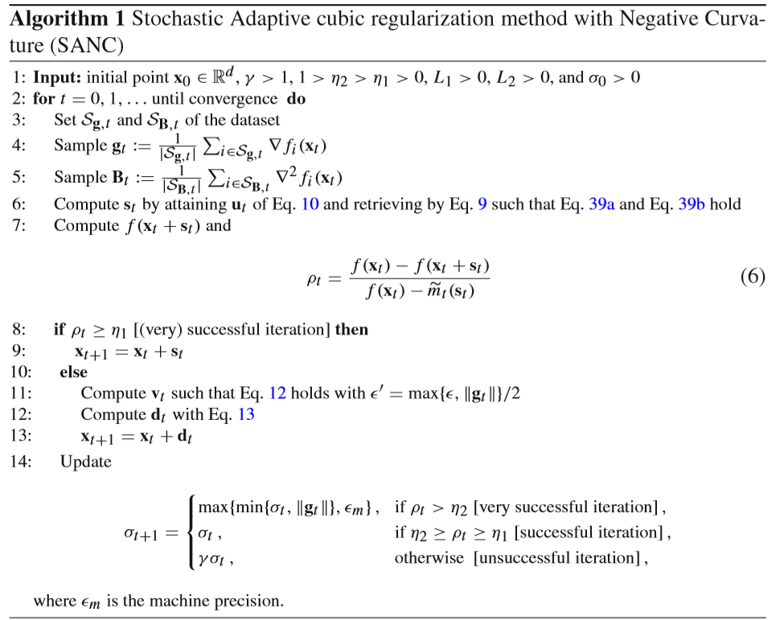

## SANC 
### : Stochastic Adaptive cubic regularization with Negative Curvature

<div align="center">
  
</div>

### [Paper](https://link.springer.com/article/10.1007/s10957-019-01624-6){:target="_blank"} | [Arxiv[pdf]](https://arxiv.org/abs/1906.11417){:target="_blank"}

> **Abstract** *We focus on minimizing nonconvex finite-sum functions that typically arise in machine learning problems. In an attempt to solve this problem, the adaptive cubic-regularized Newton method has shown its strong global convergence guarantees and the ability to escape from strict saddle points. In this paper, we expand this algorithm to incorporating the negative curvature method to update even at unsuccessful iterations. We call this new method Stochastic Adaptive cubic regularization with Negative Curvature (SANC). Unlike the previous method, in order to attain stochastic gradient and Hessian estimators, the SANC algorithm uses independent sets of data points of consistent size over all iterations. It makes the SANC algorithm more practical to apply for solving large-scale machine learning problems. To the best of our knowledge, this is the first approach that combines the negative curvature method with the adaptive cubic-regularized Newton method. Finally, we provide experimental results, including neural networks problems supporting the efficiency of our method.*

## Usage
```
python main.py
```

## Results
<div align="center">
  
</div>

## Citation
If you want to cite this, please refer to the following:
```
@article{park2020combining,
  title={Combining Stochastic Adaptive Cubic Regularization with Negative Curvature for Nonconvex Optimization},
  author={Park, Seonho and Jung, Seung Hyun and Pardalos, Panos M},
  journal={Journal of Optimization Theory and Applications},
  volume={184},
  number={3},
  pages={953--971},
  year={2020},
  publisher={Springer}
}
```